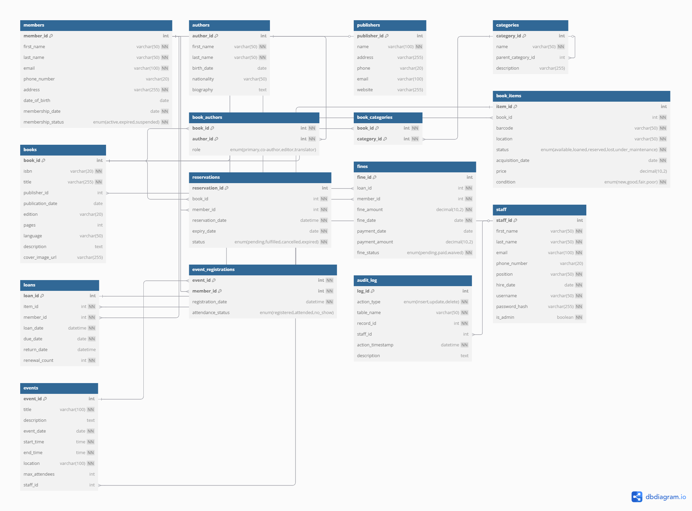

# Library Management System Database

## Project Description
This project implements a comprehensive Library Management System database using MySQL. The system is designed to manage all aspects of a library's operations including book inventory, member management, loans, reservations, fines, staff, and events.

## Features
- Complete member management system
- Book catalog with author and publisher information
- Physical book item tracking with status management
- Loan and reservation system
- Fine calculation and payment tracking
- Staff management with access control
- Event management and registration
- Comprehensive audit logging

## Database Structure
The database includes the following main entities:
- Members
- Books and Book Items (physical copies)
- Authors
- Publishers
- Categories
- Loans
- Reservations
- Fines
- Staff
- Events

## Relationships Implemented
- One-to-Many: Books to Book Items
- Many-to-Many: Books to Authors
- Many-to-Many: Books to Categories
- Many-to-Many: Events to Members
- One-to-Many: Members to Loans
- One-to-Many: Book Items to Loans

## Setup Instructions
1. Install MySQL Server if not already installed
2. Open MySQL command line or a tool like MySQL Workbench
3. Run the SQL script:
   ```
   mysql -u username -p < library_management_system.sql
   ```
4. The script will create the database, tables, views, stored procedures, and triggers

## Entity Relationship Diagram (ERD)


## Stored Procedures
- `check_out_book`: Handles the book checkout process
- `return_book`: Processes book returns and calculates fines
- `renew_book_loan`: Extends loan periods for members

## Views
- `available_books`: Shows all books with available copies
- `overdue_loans`: Lists all currently overdue loans
- `member_activity`: Summarizes member borrowing activity

## Triggers and Events
- Automatic status updates when reservations are fulfilled
- Audit logging for important database changes
- Daily check for overdue books to generate fines

## Author
Ian Otieno